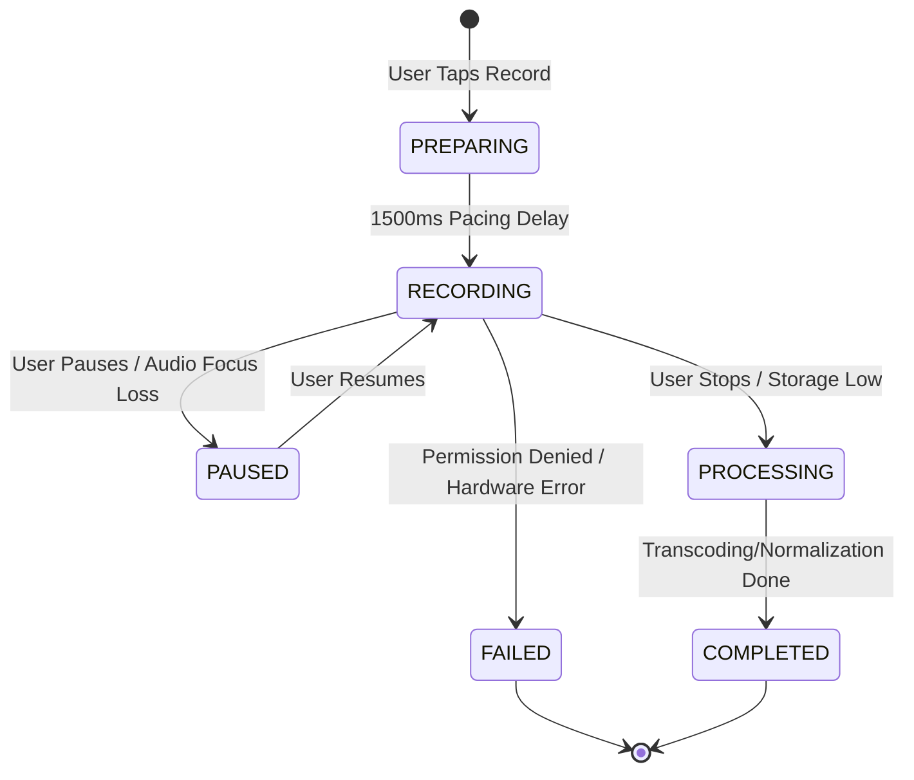
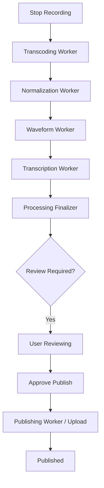

# Production-Readiness Assessment: Audio-Centric Application Architecture

## 1. Executive Summary
The proposed architecture represents a significant step toward a stable, production-grade platform. The shift from fragmented state to **Authoritative Domain Services** (`PlaybackSessionManager`, `ReviewAuthorityService`, `RecordingSessionManager`) successfully addresses the primary risks of state desynchronization and review-gating exploits. The implementation of **Segment-Based Coverage Tracking** using `BitSet` and **Speed-Adjusted Effort Validation** provides a robust foundation for community trust and content monetization.

## 2. Overall Architecture Score: 8.5 / 10
*   **Strengths (9/10):** Domain isolation, lifecycle resilience, and intentional UX pacing.
*   **Weaknesses (7/10):** Interaction reliability (error feedback), static validation policies, and basic local moderation.

## 3. Critical Strengths
-   **Durable Capture**: `RecordingService` implements a robust sync-to-disk strategy (Durable Sync) that minimizes data loss during crashes.
-   **Atomic Identity**: Separation of public pseudonyms from private Auth IDs via Firestore transactions and 30-day cooldowns.
-   **Resilient Publishing**: Use of `WorkManager` with resumable uploads and idempotent checkpoints ensures publishing survives app termination and network failures.
-   **Single Playback Authority**: `PlaybackSessionManager` ensures exclusive audio focus and unified state across Feed, Mini-player, and Immersive views.

## 4. Critical Weaknesses
-   **Interaction Dead-Ends**: Many UI actions (Follow, Resonate) lack explicit error handling or "optimistic update with rollback" logic, leading to "dead interactions" on network failure.
-   **Static Review Policy**: The fixed segment size and coverage requirements do not scale well for ultra-short or long-form audio.
-   **Processing Visibility**: The UI lacks granular visibility into the multi-stage processing pipeline (Transcoding -> Transcription -> Waveform), which can lead to user frustration during longer processing times.

## 5. Playback Architecture Review
**Assessment:** The `PlaybackSessionManager` implementation is excellent. Using `MediaController` as the interface to a `MediaSessionService` (`PlaybackService`) correctly leverages Media3 for background resilience and lock-screen controls.
**Recommendation:**
-   Introduce an `InteractionOwner.SERVICE` for automated system playback (e.g., AI narration).
-   Explicitly handle `AudioAttributes.USAGE_ASSISTANCE_SONIFICATION` for UI sounds to prevent them from interrupting main playback.

## 6. Review Validation Review
**Assessment:** Replacing position-based completion with **BitSet Coverage** is the correct decision. It prevents "end-skipping" exploits and rewards genuine listening.
**Recommendation:**
-   **Dynamic Segmenting:** Scale `segmentSizeMs` based on total duration (e.g., 500ms for < 1 min, 5s for > 10 mins).
-   **Tamper Resistance:** Include a `checksum` of the audio file in the `ReviewEvidence` to prevent evidence from being applied to modified versions of the same artifact.

## 7. Publishing Workflow Review
**Assessment:** The `PublishingOrchestrator` correctly chains `WorkManager` tasks. Idempotency is handled well via checkpoints.
**Recommendation:**
-   **Expedited Jobs:** Mark the `TranscodingWorker` as "Expedited" to ensure quick turnaround for the user after they hit stop.
-   **Partial Recovery:** Ensure `TranscodingWorker` can resume from partial AAC files using a custom `MediaMuxer` wrapper or simply restart (transcoding is usually fast enough).

## 8. Recording Architecture Review
**Assessment:** `RecordingService` uses `FOREGROUND_SERVICE_TYPE_MICROPHONE` and `WakeLock` appropriately.
**Recommendation:**
-   **Audio Focus Conflict:** If a user starts a recording while another app is playing music, the current implementation pauses the music. This is correct, but adding a "Gentle Fade" or a "Ducking" request might improve the UX.
-   **Recovery Engine:** Move the recovery logic from `RecordingService.onCreate` into a dedicated `RecoveryWorker` triggered on app start to avoid service bloat.

## 9. Identity & Privacy Review
**Assessment:** Separation of identities is handled correctly via sub-collections.
**Recommendation:**
-   **Audit Log:** Add a `private/identity_history` collection to track identity changes for moderation purposes (detecting ban evasion).
-   **Signature Verification:** Future-proof the anonymous identity by signing the `anonymousId` with a server-side secret to prevent spoofing in client-side trust calculations.

## 10. Scalability Assessment
The architecture is well-positioned for:
-   **Voice Replies:** Can reuse the `Recording` and `Playback` domains as-is.
-   **Trust Scoring:** The `effortMap` in `ReviewEvidence` provides the raw data needed for "Deep Listening" rewards.
-   **Recommendation Engines:** `personalizationEngine` is already integrated into the `ArtifactRepository`.

---

## 11. Recommended Service Boundaries

| Domain | Authority / Manager | Primary Responsibility |
| :--- | :--- | :--- |
| **Playback** | `PlaybackSessionManager` | Global Audio Focus, Media3 Controller Sync |
| **Review** | `ReviewAuthorityService` | Coverage Tracking, Completion Validation, Persistence |
| **Publishing**| `PublishingOrchestrator` | WorkManager Pipeline, Upload Checkpoints |
| **Recording** | `RecordingSessionManager`| Hardware State, Durable Sync, Pacing |
| **Identity** | `UserSessionManager` | Pseudonymity, Cooldowns, Private Data Guarding |
| **Moderation**| `ModerationService` | Pre-publish Nudges, Reporting, Safety Analysis |

---

## 12. Recommended Data Models

### Review Evidence (Room)
```kotlin
@Entity(tableName = "review_evidence")
data class ArtifactReviewEvidence(
    @PrimaryKey val artifactId: String,
    val audioChecksum: String, // Ensure evidence matches audio content
    val version: Int,          // Track schema migrations for evidence
    val coverage: ByteArray,   // BitSet
    val effortMap: Map<Float, Long>,
    val lastUpdated: Long
)
```

### Artifact Draft (Room)
```kotlin
@Entity(tableName = "drafts")
data class ArtifactDraftEntity(
    @PrimaryKey val id: String,
    val localAudioPath: String,
    val rawPcmPath: String?,   // For recovery
    val durableBytes: Long,     // Checkpoint of persisted bytes
    val status: DraftStatus     // Combined lifecycle/processing/sync
)
```

---

## 13. Recommended State Machines

### Recording State Machine


### Publishing Pipeline


---

## 14. Migration Strategy
1.  **Phase 1: Dual Writes.** Keep position-based tracking but start writing `BitSet` coverage in parallel.
2.  **Phase 2: Authority Transition.** Switch `isCommentUnlocked` to use the `ReviewAuthorityService` as the source of truth.
3.  **Phase 3: Backfill.** For existing artifacts, estimate coverage from the old `lastPositionMs`.

---

## 15. Prioritized Implementation Roadmap
1.  **Immediate (Week 1):** Stabilize `PlaybackSessionManager` and `ReviewAuthorityService`. Connect `PlaybackService` to lock-screen.
2.  **Near-Term (Week 2):** Implement the `WorkManager` chain for processing. Add "Optimistic Rollbacks" to UI interactions.
3.  **Mid-Term (Week 3):** Implement Dynamic Review Policies and "Deep Listening" Trust Tiers.
4.  **Long-Term (Week 4+):** AI-driven local moderation and Community Trust Scoring.

---

## 16. Final Recommendation: **APPROVE WITH CHANGES**
The architecture is technically sound. The requested changes focus on **Interaction Reliability** and **Validation Policy Fluidity** to ensure the platform feels alive and scales gracefully with different content lengths.
