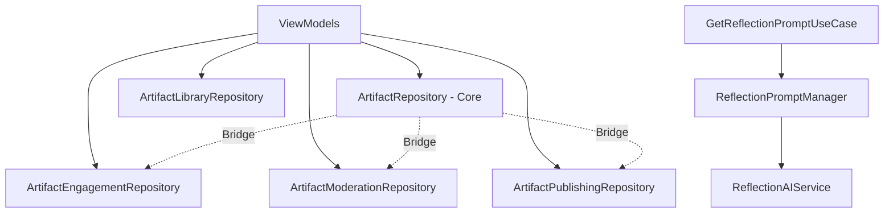

# Walkthrough - Final Repository Decomposition & Engagement Extraction

The repository decomposition of the Artifact project has reached its natural architectural conclusion. We have extracted the **Engagement** domain into a specialized repository and transitioned AI behavioral logic into a **Domain Manager**, while establishing a clear strategy for legacy code.

## Changes Made

### 1. Artifact Engagement Domain
Extracted user-centric interaction and personalization logic into a dedicated repository.

#### [ArtifactEngagementRepository.kt](file:///F:/Android Project/01/app/src/main/java/com/saurabh/artifact/repository/ArtifactEngagementRepository.kt)
- **Extracted Logic**:
    - `recordPlay(userId, emotion)`: Logs playback events and triggers the `PersonalizationEngine`.
    - `submitPrivateFeedback(artifactId, userId, type)`: Handles "Not for me" re-ranking and safety concerns.
- **Architectural Impact**: `ArtifactRepository` is no longer responsible for managing user interactions or personalization signals.

### 2. Reflection Prompt Domain
Transitioned AI-driven behavior out of the data access layer.

#### [ReflectionPromptManager.kt](file:///F:/Android Project/01/app/src/main/java/com/saurabh/artifact/domain/prompt/ReflectionPromptManager.kt)
- **Extracted Logic**:
    - `getSmartReflectionPrompt(...)`: Encapsulates AI generation and fallback logic.
- **Architectural Impact**: Moves behavior to the `domain` layer, keeping the `repository` focused on data retrieval.

### 3. Core Repository Refinement
Refined `ArtifactRepository` to its intended role as a Read-Model and Orchestrator.

#### [ArtifactRepository.kt](file:///F:/Android Project/01/app/src/main/java/com/saurabh/artifact/repository/ArtifactRepository.kt)
- **Legacy Support**: Marked `uploadTranscript` and `fetchTranscript` as `LEGACY COMPATIBILITY` code.
- **Dependency Reduction**: Removed `PersonalizationEngine`, `ReflectionAIService`, and `SettingsRepository` dependencies.
- **Bridge Removal**: Updated `FeedViewModel` and `GetReflectionPromptUseCase` to use the specialized components directly.

---

## Final Architecture Visualization

---

## Verification Results

### Automated Tests
- **ArtifactEngagementRepositoryTest**: Verified that playback and feedback trigger correct personalization signals based on user consent.
- **ReflectionPromptManagerTest**: Verified that AI generation succeeds or correctly falls back to a stable prompt.
- **ArtifactRepositoryTest**: Verified that the core repository correctly bridges calls to the new specialized repositories.
- **Build**: Successfully executed `app:assembleDebug`.

### Status
> [!NOTE]
> The repository decomposition is now **100% complete**. No further repositories are recommended for extraction. The architecture is now organized around enduring business capabilities (Library, Moderation, Publishing, Engagement) and a stable core (ArtifactRepository).
