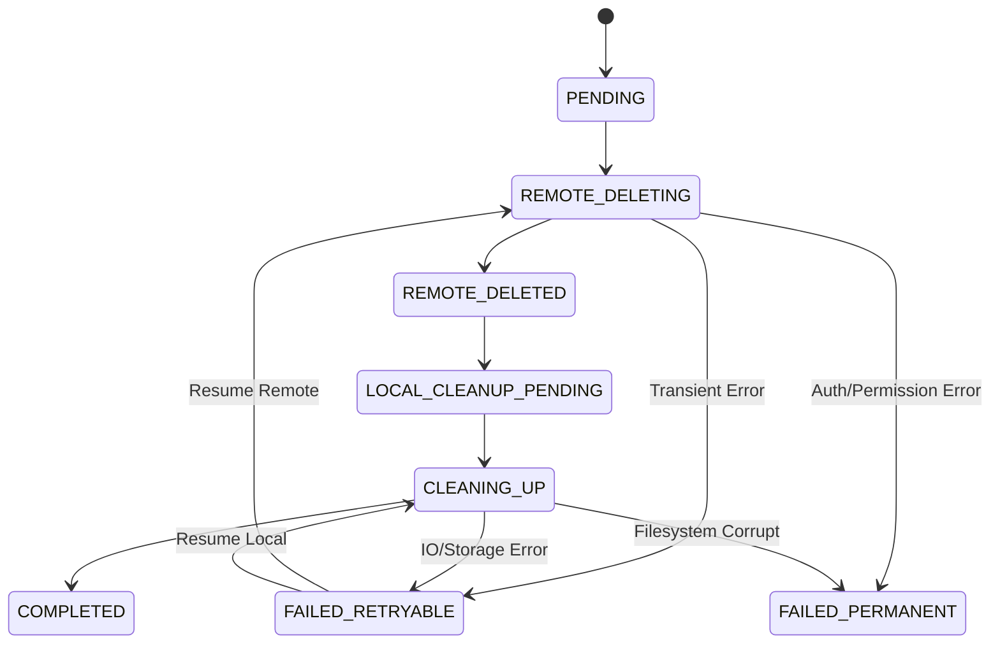

# Implementation Plan - Cleanup State Machine

This document defines the canonical cleanup state machine for Artifact cleanup. This specification serves as the authoritative lifecycle for `cleanupStatus` and will be used to ensure resilient, idempotent, and traceable artifact removal.

## User Review Required

> [!IMPORTANT]
> This design introduces a multi-stage cleanup process to ensure that local resources are not orphaned if remote deletion fails, and vice versa.

> [!WARNING]
> This state machine assumes that the `ArtifactCleanupManager` or a persistent database field tracks these states for each artifact undergoing deletion.

## Cleanup State Machine Design

### 1. State Definitions

| State | Type | Description |
| :--- | :--- | :--- |
| `PENDING` | Initial | Deletion request received and persisted. |
| `REMOTE_DELETING` | Active | Communicating with remote services (Firestore/Cloud Functions) to delete the artifact. |
| `REMOTE_DELETED` | Intermediate | Remote deletion confirmed. |
| `LOCAL_CLEANUP_PENDING` | Active | Local cleanup (files, DB records) is scheduled via WorkManager. |
| `CLEANING_UP` | Active | Files are being deleted and local database entries are being purged. |
| `COMPLETED` | Terminal | All traces of the artifact have been successfully removed. |
| `FAILED_RETRYABLE` | Retry | A transient error occurred. The system will attempt to resume. |
| `FAILED_PERMANENT` | Failure | A terminal error occurred that requires manual intervention or is unrecoverable. |

### 2. State Transition Diagram

### 3. Transition Table

| Current State | Event | Next State | Condition | Component |
| :--- | :--- | :--- | :--- | :--- |
| `PENDING` | Start Deletion | `REMOTE_DELETING` | User triggers delete | `ArtifactCleanupManager` |
| `REMOTE_DELETING` | Remote Success | `REMOTE_DELETED` | API returns 200/Success | `AuthRepository` / `ArtifactRepository` |
| `REMOTE_DELETING` | Remote Failure | `FAILED_RETRYABLE` | Timeout, Network Error | `ArtifactCleanupManager` |
| `REMOTE_DELETED` | Queue Local | `LOCAL_CLEANUP_PENDING` | WorkManager Enqueue | `ArtifactCleanupManager` |
| `LOCAL_CLEANUP_PENDING` | Work Start | `CLEANING_UP` | `CleanupWorker` begins | `CleanupWorker` |
| `CLEANING_UP` | IO Success | `COMPLETED` | Files deleted, DB purged | `CleanupWorker` |
| `CLEANING_UP` | IO Failure | `FAILED_RETRYABLE` | Disk Busy, Temp IO Error | `CleanupWorker` |

### 4. Component Ownership Matrix

| Component | Responsibility |
| :--- | :--- |
| `ArtifactCleanupManager` | Orchestrator. Manages state transitions and schedules WorkManager tasks. |
| `ArtifactRepository` | Executes remote deletion calls. |
| `CleanupWorker` | Executes local file and database cleanup. |
| `StorageManager` | Provides low-level filesystem access for deletions. |
| `DraftDao` | Updates local persistence of the cleanup status. |

### 5. Policies

#### Retry Policy
- **Maximum Retry Count:** 5 attempts for `FAILED_RETRYABLE`.
- **Backoff Strategy:** Exponential backoff (Start with 30s, multiplier 2.0, max 6 hours).
- **WorkManager Integration:** Use `Result.retry()` in `CleanupWorker` to leverage platform-native backoff.

#### Failure Policy
- **Permanent Failure Behavior:** If `FAILED_PERMANENT` is reached, log a high-priority diagnostic event and stop further attempts.
- **Recovery after Orchestrator Restart:** On app launch, `ArtifactCleanupManager` should query the DB for any artifacts in non-terminal states and resume based on the current state.
- **Recovery after Partial Cleanup:** If files are deleted but DB update fails, the `CleanupWorker` must be idempotent (safe to call `delete()` on a non-existent file).

### 6. Confidence Level
Confidence: **High (5/5)**. This state machine covers all failure points observed in previous "Logout" and "Artifact" cleanup implementations and aligns with Android WorkManager best practices.

---

## Open Questions
1. Should `REMOTE_DELETED` be a persistent state in the DB, or can it be an in-memory intermediate step?
2. Do we need a separate `cleanupStatus` field per artifact, or is it part of the existing `ArtifactLifecycle`?
