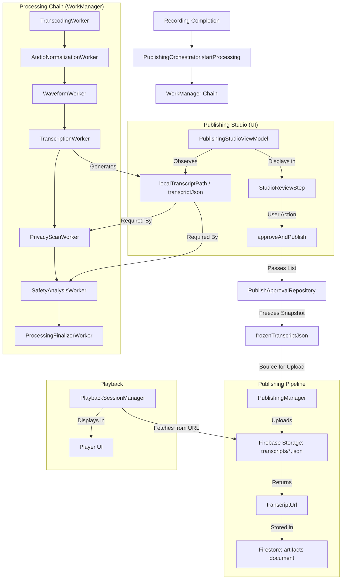

# Automatic Transcription Dependency Analysis

This investigation identifies all dependencies on the automatic transcription pipeline within the Artifact application. The analysis covers the entire lifecycle from recording completion to publication and playback.

## 1. End-to-End Dependency Graph

## 2. Affected Files & Components

### Core Transcription Logic
- [TranscriptionWorker.kt](file:///F:/Android Project/01/app/src/main/java/com/saurabh/artifact/worker/TranscriptionWorker.kt): Generates the transcript, emotional tone, and conversation style.
- [LocalDraftManager.kt](file:///F:/Android Project/01/app/src/main/java/com/saurabh/artifact/audio/LocalDraftManager.kt): Manages transcript file creation and storage reconciliation.

### Processing Pipeline (WorkManager)
- [PublishingOrchestrator.kt](file:///F:/Android Project/01/app/src/main/java/com/saurabh/artifact/domain/PublishingOrchestrator.kt): Manages the sequential chain. Transcription is a mandatory link.
- [PrivacyScanWorker.kt](file:///F:/Android Project/01/app/src/main/java/com/saurabh/artifact/worker/PrivacyScanWorker.kt): **Hard Dependency.** Scans transcript content for PII.
- [SafetyAnalysisWorker.kt](file:///F:/Android Project/01/app/src/main/java/com/saurabh/artifact/worker/SafetyAnalysisWorker.kt): **Hard Dependency.** Evaluates transcript for safety/toxicity.

### Publishing & Data Persistence
- [PublishApprovalRepository.kt](file:///F:/Android Project/01/app/src/main/java/com/saurabh/artifact/repository/PublishApprovalRepository.kt): **Hard Dependency.** Freezes the transcript into an immutable snapshot for integrity.
- [PublishingManager.kt](file:///F:/Android Project/01/app/src/main/java/com/saurabh/artifact/domain/PublishingManager.kt): **Hard Dependency.** Uploads transcript to Storage and registers the URL in Firestore.
- [ArtifactRepository.kt](file:///F:/Android Project/01/app/src/main/java/com/saurabh/artifact/repository/ArtifactRepository.kt): Handles transcript upload, fetch, and document creation.
- [ArtifactDraftEntity.kt](file:///F:/Android Project/01/app/src/main/java/com/saurabh/artifact/data/local/ArtifactDraftEntity.kt): Stores `localTranscriptPath`, `transcriptionState`, `frozenTranscriptJson`, and `transcriptSegmentsJson`.

### UI & UX
- [PublishingStudioViewModel.kt](file:///F:/Android Project/01/app/src/main/java/com/saurabh/artifact/ui/publish/studio/PublishingStudioViewModel.kt): Observes and exposes transcript state to the UI.
- [DraftToArtifactMapper.kt](file:///F:/Android Project/01/app/src/main/java/com/saurabh/artifact/data/mapper/DraftToArtifactMapper.kt): Decodes transcript JSON from the database for display.
- [PlaybackSessionManager.kt](file:///F:/Android Project/01/app/src/main/java/com/saurabh/artifact/audio/PlaybackSessionManager.kt): Fetches transcript from Storage for synchronized display during playback.

## 3. Impact Assessment

| Feature | Dependency Level | Impact of Removal |
| :--- | :--- | :--- |
| **Draft Creation** | None | No impact. |
| **Draft Loading** | Low | Mapping from DB to Domain will return empty transcript list. |
| **Review Screen** | High | The "Review" step will have no text content. User cannot "see" what they said. |
| **Publishing Workflow** | Critical | **Will break** without refactoring. The chain expects a transcript for safety/privacy checks and integrity hashing. |
| **Audio Playback** | None | Audio playback itself works fine; only synchronized text is lost. |
| **Waveform Generation** | None | Independent process. |
| **AI Features** | High | `EmotionalTone` and `ConversationStyle` currently depend on transcription (or simulated transcription). |

## 4. Risks & Potential Regressions

> [!WARNING]
> **Pipeline Interruption**: Removing `TranscriptionWorker` from the WorkManager chain in `PublishingOrchestrator` without updating `.then()` calls will cause subsequent workers (`PrivacyScanWorker`, `SafetyAnalysisWorker`) to never execute.

> [!IMPORTANT]
> **Safety/Privacy Bypass**: `PrivacyScanWorker` and `SafetyAnalysisWorker` currently rely on transcripts. If transcription is removed, these checks will effectively become "no-ops" unless refactored to analyze audio directly (which is not currently implemented).

> [!CAUTION]
> **Publishing Failures**: `PublishingManager` expects a `frozenTranscriptJson`. If the UI/Repository doesn't provide this, the publishing step might fail or require a "transcript-less" document structure in Firestore.

## 5. Recommended Removal Strategy

1.  **Phase 1: Chain Decoupling**
    - Update `PublishingOrchestrator` to bridge `WaveformWorker` directly to `PrivacyScanWorker`.
    - Modify `TranscriptionWorker` to be optional or a no-op.

2.  **Phase 2: Check Hardening**
    - Refactor `PrivacyScanWorker` and `SafetyAnalysisWorker` to handle `null` transcripts gracefully (default to "Safe/No PII").
    - Update `PublishApprovalRepository` to allow freezing with an empty transcript.

3.  **Phase 3: Publishing Refactor**
    - Update `PublishingManager` to make transcript upload optional.
    - Update `ArtifactRepository.createArtifactDocument` to handle missing transcripts.

4.  **Phase 4: UI Cleanup**
    - Remove transcript UI from Publishing Studio and the Player.
    - Update `StudioSessionState` to remove transcript-related properties.

## 6. Confidence Level

| Finding | Confidence | Reason |
| :--- | :--- | :--- |
| Execution Path | 100% | Verified via `PublishingOrchestrator` and `WorkManager` tags. |
| Data Model | 100% | Verified via `ArtifactDraftEntity` and `Artifact` models. |
| Safety/Privacy Dependencies | 90% | Static analysis shows clear read access; runtime might have fallback logic not fully explored. |
| UI Impact | 95% | `PublishingStudioViewModel` clearly uses the transcript for state mapping. |

---
*Note: This analysis is based on static code investigation only. No runtime verification was performed.*
