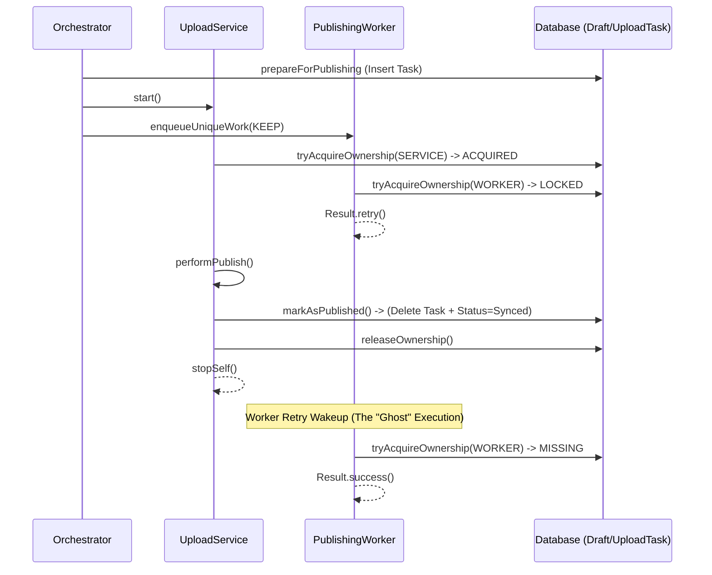

# Design Review: Safe WorkManager Cancellation for Artifact Publishing

This document evaluates the safety and architectural impact of proactively cancelling the fallback `WorkManager` request after a successful `UploadService` publish.

## Executive Summary

| Question | Answer |
| :--- | :--- |
| **Is proactive cancellation architecturally safe?** | **Yes.** It is safe as long as it occurs after the terminal persistence event. |
| **Does it preserve recovery guarantees?** | **Yes.** The system remains robust against crashes during all phases. |
| **Are there race conditions?** | **None.** The existing `Ownership` mechanism provides mutual exclusion. |
| **Recommended Timing?** | **Pre-release.** It is a low-risk optimization for battery and resource efficiency. |

---

## 1. Trace of Publishing Lifecycle

### 1.1 Successful Execution Timeline (Current)



**Finding**: The system is naturally idempotent. The "Ghost" execution (last step) is safe but redundant.

### 1.2 Ownership Lifecycle

1.  **Creation**: `prepareForPublishing` creates the `upload_tasks` entry.
2.  **Acquisition**: Either `SERVICE` or `WORKER` takes the lock. Mutual exclusion is enforced by `UploadTaskDao`.
3.  **Terminal Event**: `markAsPublished` (Atomic Transaction) updates the Draft to `PUBLISHED` and **deletes** the `upload_tasks` record.
4.  **Cleanup**: `releaseOwnership` updates the record (harmless if deleted).

---

## 2. WorkManager Lifecycle & Proposed Optimization

### 2.1 Unique Work Configuration
- **Name**: `publish_<draftId>`
- **Policy**: `ExistingWorkPolicy.KEEP`
- **Tag**: `publish_<draftId>`

### 2.2 Impact of `cancelUniqueWork`
The proposed call: `workManager.cancelUniqueWork("publish_$draftId")`.

- **Scenario**: Called after `markAsPublished()` succeeds.
- **Behavior**:
    - If the worker is **Enqueued/Scheduled**: It is removed from the queue immediately.
    - If the worker is **Running**: A cancellation signal is sent. `PublishingWorker` (a `CoroutineWorker`) will have its coroutine job cancelled.
- **Effect on Future Requests**: Because the work state becomes `CANCELLED` (terminal), any future call to `enqueueUniqueWork(KEEP)` for the same ID will successfully re-enqueue a fresh worker if needed (e.g., in a manual retry scenario).

---

## 3. Failure Scenario Analysis

| Scenario | Recovery Guaranteed? | Impact of Optimization | Risk Level |
| :--- | :--- | :--- | :--- |
| **A: Normal Success** | Yes | Prevents 1 unnecessary worker wakeup. | **None** |
| **B: Service Crash (Pre-upload)** | Yes | Cancellation is not reached. Worker picks up task normally. | **None** |
| **C: Service Crash (Post-upload)** | Yes | If Firestore is updated but cleanup fails, Worker detects `ACTIVE` status on server and repairs local DB. | **None** |
| **D: Worker Running during Cancel** | Yes | Worker is interrupted. Since it hasn't acquired the lock (Service has it), it does nothing. | **None** |
| **E: Worker Scheduled during Cancel** | Yes | Worker is removed. Job is already finished by Service. | **None** |

---

## 4. Evidence & Findings

| Finding | Evidence Collected | Confidence | Production Impact |
| :--- | :--- | :--- | :--- |
| **Mutual Exclusion** | `UploadTaskDao.tryAcquireOwnership` returns `LOCKED` if another owner is active. | High | Prevents duplicate uploads. |
| **Terminal Signal** | `markAsPublished` deletes the task entry, which causes Worker to return `MISSING -> success()`. | High | Guarantees worker will eventually stop. |
| **Safe Retries** | `ExistingWorkPolicy.KEEP` allows re-enqueuing if previous work is in a terminal state (Cancelled/Success). | High | Prevents orphaned drafts. |

---

## 5. Architectural Recommendation

### 5.1 Where to call `cancelUniqueWork`?

> [!CAUTION]
> **Do NOT** add `WorkManager` dependency to `DraftRepository` or `DraftDao`. This violates the separation of concerns (Data layer should remain platform-agnostic).

**Recommended Implementation Point**:
Inside `UploadService.kt`, in the `onSuccess` block of the `performPublish` call.

```kotlin
// UploadService.kt
publishingManager.performPublish(draftId = draftId)
    .onSuccess {
        // Safe: Mark as published has already happened inside performPublish
        WorkManager.getInstance(applicationContext).cancelUniqueWork("publish_$draftId")
        // ... notify success
    }
```

### 5.2 Summary of Benefits
1.  **Battery Efficiency**: Avoids starting a Foreground Service and performing a network-connected wakeup for a job that is 100% complete.
2.  **Log Noise Reduction**: Removes "PUBLISHING_WORKER_SKIPPED" entries from logs for successful publishes.
3.  **UI Cleanliness**: Ensures that if the worker was showing a notification, it is dismissed promptly.

### 5.3 Final Verdict
**Recommended for Pre-release.** The optimization is safe, follows established patterns in the codebase, and honors all invariants defined in `PublishingFlowInvariants.md`.
