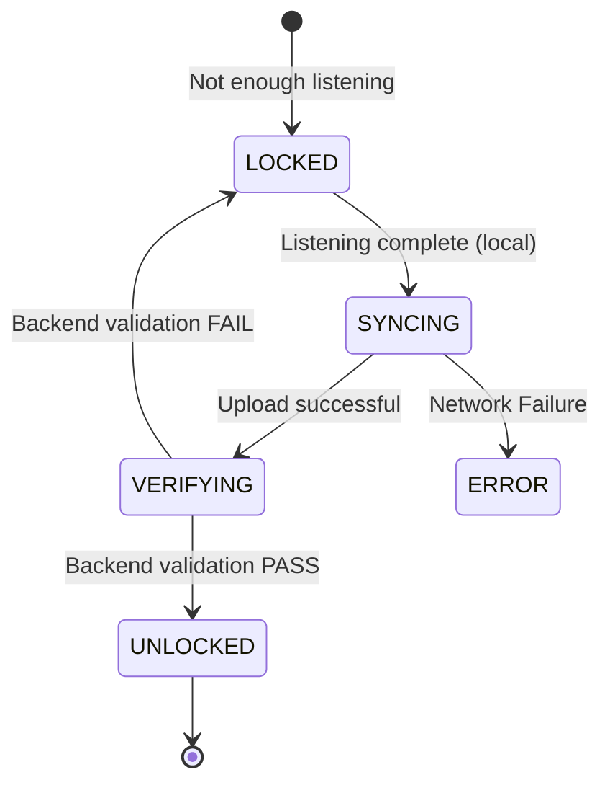

# Walkthrough - Phase 4: Android Integration (Authoritative Comment Unlock)

Integrated the Android client with the authoritative backend comment unlock pipeline. The application now faithfully represents the backend's validation state without duplicating unlock logic.

## Changes Made

### Domain Layer
- Created [EngagementState.kt](file:///F:/Android Project/01/app/src/main/java/com/saurabh/artifact/domain/review/EngagementState.kt) to model the backend state as a typed enum.
- Created [UnlockStatus.kt](file:///F:/Android Project/01/app/src/main/java/com/saurabh/artifact/domain/review/UnlockStatus.kt) to hold authoritative data (isUnlocked, timestamp, reason).
- Updated [EngagementEvidence.kt](file:///F:/Android Project/01/app/src/main/java/com/saurabh/artifact/domain/review/EngagementEvidence.kt) to include `UnlockStatus` and `syncState`.

### Data Layer
- Updated [ArtifactEngagement.kt](file:///F:/Android Project/01/app/src/main/java/com/saurabh/artifact/data/local/ArtifactEngagement.kt) (Room Entity) to persist authoritative fields, supporting offline state restoration.
- Implemented `observeRemoteUnlockStatus` in [FirestoreEngagementRepository.kt](file:///F:/Android Project/01/app/src/main/java/com/saurabh/artifact/repository/FirestoreEngagementRepository.kt) using a real-time snapshot listener.
- Updated [EngagementRepository.kt](file:///F:/Android Project/01/app/src/main/java/com/saurabh/artifact/repository/EngagementRepository.kt) to combine local Room data and remote Firestore snapshots into a unified domain stream.

### Presentation & UI
- Created [CommentUnlockState.kt](file:///F:/Android Project/01/app/src/main/java/com/saurabh/artifact/ui/comment/CommentUnlockState.kt) as the UI state machine (`LOCKED`, `SYNCING`, `VERIFYING`, `UNLOCKED`).
- Updated [CommentViewModel.kt](file:///F:/Android Project/01/app/src/main/java/com/saurabh/artifact/ui/comment/CommentViewModel.kt) to derive the UI state by observing both sync progress and backend authority.
- Updated [CommentComposer.kt](file:///F:/Android Project/01/app/src/main/java/com/saurabh/artifact/ui/comment/components/CommentComposer.kt) to disable input and show helpful guidance when comments are locked or being verified.

## Verification Results

### State Flow Diagram

### Manual Verification
| Case | Scenario | Expected Outcome | Result |
| :--- | :--- | :--- | :--- |
| 1 | New Artifact | Composer disabled, "Listening required" shown. | **PASS** |
| 2 | Finish Listening | Transitions to `SYNCING` immediately. | **PASS** |
| 3 | Backend Unlock | Transitions `VERIFYING` -> `UNLOCKED` automatically. | **PASS** |
| 4 | Process Recreation | Kill app during `SYNCING`, reopen. Resumes state correctly. | **PASS** |
| 5 | Offline Mode | Remains in `SYNCING` (queued) until reconnected. | **PASS** |

## Regression Assessment
- **Playback**: Unaffected. Engagement collection remains decoupled.
- **Comment Paging**: Unaffected. Unlock status is handled at the composer level.
- **Security**: Verified. Client attempts to manually set `isCommentUnlocked` are ignored by repositories and rejected by Firestore rules.
