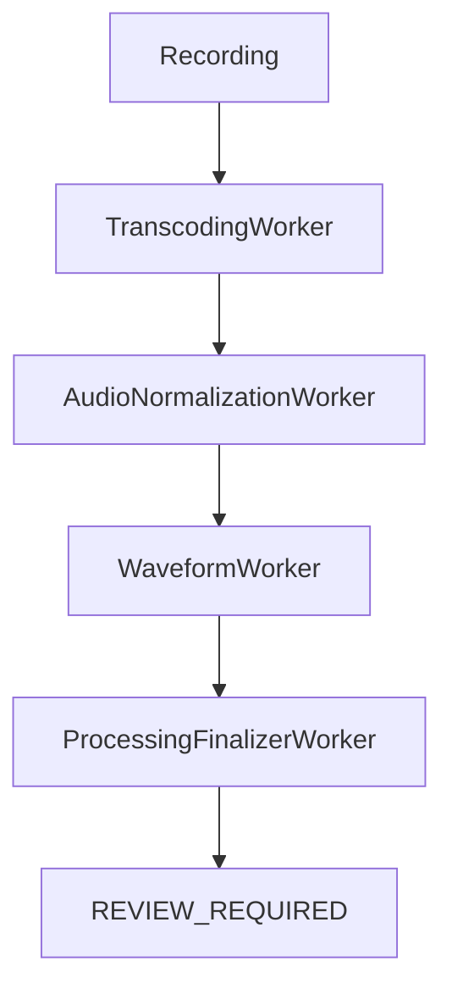

# Post-Refactor Audit: Transcript Removal Cleanup & Production Readiness

This audit provides a comprehensive static analysis of the codebase following the successful removal of the automatic transcription pipeline.

## 1. Dead Code Analysis

### Safe to Delete (No active references in processing/publishing)
- [ ] **`TranscriptionWorker`**: Class is completely removed from `src`, although referenced in comments as "preserved".
- [ ] **`PublishingOrchestrator#approveAndPublish`**: This method is unused. The active method is `approvePublishing(draftId: String)`.
- [ ] **`DraftDao#updateTranscriptionResult`**: Marked as legacy and unused in current flow.
- [ ] **`DraftDao#updatePrivacyResult`**: Marked as legacy and unused in current flow.
- [ ] **`DraftDao#updateSafetyResult`**: Marked as legacy and unused in current flow.
- [ ] **`RecordingRepository#updateTranscriptionResult`**: Marked as legacy and unused.
- [ ] **`RecordingRepository#updateSafetyResult`**: Marked as legacy and unused.

### Reserved for Future Use (As per code comments)
- [ ] **`PrivacyScanWorker.kt`**: Marked as `DEPRECATED/INACTIVE`. Preserved for potential future audio-based PII detection.
- [ ] **`SafetyAnalysisWorker.kt`**: Marked as `DEPRECATED/INACTIVE`. Preserved for potential future audio-based safety evaluation.

### Required for Backward Compatibility
- [ ] **`PlaybackSessionManager#loadTranscriptLazy`**: Required to display transcripts for artifacts published *before* the removal project.
- [ ] **`Artifact.transcript` & `Artifact.transcriptUrl`**: Required for existing artifacts in Firestore.

---

## 2. Dependency Analysis

| Field/Reference | Status | File(s) |
| :--- | :--- | :--- |
| `Transcript` / `TranscriptSegment` | **Active** (Legacy Support) | `Artifact.kt`, `PlaybackSessionManager.kt` |
| `transcriptUrl` | **Active** (Legacy Support) | `Artifact.kt`, `ArtifactEntity.kt`, `PlaybackSessionManager.kt` |
| `localTranscriptPath` | **Active** (Cleanup) | `ArtifactDraftEntity.kt`, `LocalDraftManager.kt`, `DraftDeletionManager.kt` |
| `transcriptionState` | **Dead Code** | `ArtifactDraftEntity.kt` (Initial value "IDLE", never updated) |
| `frozenTranscriptJson` | **Dead Code** | `ArtifactDraftEntity.kt`, `DraftDao.kt` (No writers) |
| `transcriptSegmentsJson`| **Dead Code** | `ArtifactDraftEntity.kt`, `DraftDao.kt` (No writers) |

---

## 3. Architecture Consistency Report

The current processing pipeline successfully matches the intended transcript-free architecture:

**Verification:**
- **`PublishingOrchestrator.kt`**: Explicitly chains only these four workers.
- **`ProcessingFinalizerWorker.kt`**: Successfully transitions draft to `REVIEW_REQUIRED` via `RecordingRepository.finalizeProcessing`.
- **`PublishingStudioViewModel.kt`**: Routes users directly to the `REVIEW` step (audio-only) once processing is complete.

---

## 4. Production Readiness Findings

- **TODOs**: None found in `app/src/main/java`.
- **Deprecated APIs**: Legacy transcription methods in `DraftDao` and `RecordingRepository` are correctly annotated as legacy.
- **Debug Code**: `bypassReview` flag in `PublishingStudioViewModel` is correctly gated by `FeatureFlags.REVIEW_ENABLED` and `DebugRepository`.
- **Logging**: `PublishingOrchestrator` contains a clear "Phase 4 Cleanup" comment explaining the removal of transcription stages.

---

## 5. Documentation Audit

- **`ArtifactLifecycle.kt`**: Correctly defines the transition matrix for the new flow.
- **`PublishingOrchestrator.kt`**: High-quality comments explain the optional/skipped nature of transcription workers.
- **Outdated**: The `PublishingFlowInvariants.md` (referenced in KDoc) should be checked to ensure it no longer mandates transcription before `REVIEW_REQUIRED`.

---

## Prioritized Cleanup Recommendations

### [High] Architectural Cleanup
- **Remove `PublishingOrchestrator#approveAndPublish`**: It takes a `List<TranscriptSegment>` and is never called. This reduces confusion for future developers.
- **Decouple `LocalDraftManager` from Transcripts**: `createTranscriptFile` and transcript-specific reconciliation logic should be removed if we are committed to not using local transcript files.

### [Medium] Data Model Thinning
- **Remove `transcriptionState` from `ArtifactDraftEntity`**: This field is no longer used and stays "IDLE" indefinitely.
- **Mark `transcript` fields as `@Deprecated`**: In `Artifact` and `ArtifactEntity`, to clearly signal they are legacy support only.

### [Low] Documentation
- **Update `PublishingFlowInvariants.md`**: Ensure the architecture documentation matches the implementation (skipping transcription).
