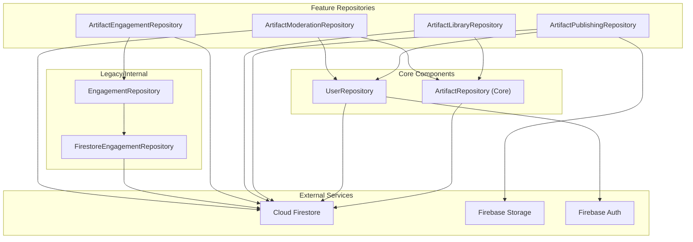

# Repository Dependency Validation Audit

**Objective**: Static architectural validation of the proposed repository decomposition for the Artifact project.
**Scope**: Verification of the one-way dependency graph, circular dependency analysis, and ownership validation.

## Proposed Dependency Graph

The following graph illustrates the target architecture after the decomposition of the "God" `ArtifactRepository`.

## Circular Dependency Analysis

### 1. Potential Cycle: Moderation <-> User
*   **Evidence**: `ArtifactModerationRepository` (AMR) needs to call `decrementArtifactsCount` in `UserRepository` (UR) during a soft delete.
*   **Risk**: If `UserRepository` ever needs to query moderation status or report a user via `AMR`, a circular dependency is created.
*   **Mitigation**: `UserRepository` currently writes reports directly to the `reports` collection in Firestore. This "leak" of moderation logic into `UR` actually prevents a hard dependency on `AMR`.
*   **Recommendation**: Maintain the direct write in `UR` or use a shared `AuditLogger` interface to decouple the two.

### 2. Potential Cycle: Library <-> Core
*   **Evidence**: `ArtifactLibraryRepository` (ALR) fetches IDs of saved artifacts and then uses `ArtifactRepository` (AR) to hydrate those IDs into full `Artifact` objects.
*   **Risk**: If `ArtifactRepository` attempts to include a `isSaved` flag in its base model by querying `ALR`, a cycle occurs.
*   **Mitigation**: The `isSaved` status should be managed at the ViewModel layer by combining flows from `AR` and `ALR`.
*   **Recommendation**: `ArtifactRepository` MUST remain agnostic of library/bookmark state.

### 3. Hilt Impact
*   **Status**: Hilt will successfully inject these repositories.
*   **Verification**: All proposed dependencies are currently using `dagger.Lazy` or direct constructor injection. The use of `Lazy` in the current `ArtifactRepository` suggests the developers are already managing complex dependency graphs. Decomposition will reduce the number of `Lazy` wrappers needed for the "Core" repository.

## Repository Ownership Validation

| Repository | Primary Owner | Source of Truth | Key Responsibilities |
| :--- | :--- | :--- | :--- |
| **ArtifactRepository** | Artifact Core | Firestore `artifacts` / Room `artifacts` | Hydration, Paging, Single Source of Truth for metadata. |
| **ArtifactPublishingRepository** | Publishing | Firestore `artifacts` / Storage / `drafts` | Resumable uploads, Draft to Document conversion, Integrity hashing. |
| **ArtifactLibraryRepository** | User Profile | Firestore `savedArtifacts` | Bookmarks, Collections, Private emotional shelves. |
| **ArtifactEngagementRepository** | Resonance | Firestore `engagement` / Personalization Engine | Play tracking, Private feedback (Not for me), Local coverage. |
| **ArtifactModerationRepository** | Safety | Firestore `reports` / `moderation` metadata | Reporting, Resolving, Soft-deletes, Admin status checks. |

## Recommended Orchestration Boundaries

Several methods in the current `ArtifactRepository` span multiple domains and should be split or moved:

1.  **`deletePublishedArtifact`**:
    *   **Current State**: Orchestrates Firestore update, User count decrement, and Local cache eviction.
    *   **Recommendation**: Move to `ArtifactModerationRepository`. It should depend on `ArtifactRepository` for "soft delete" logic and `UserRepository` for "count" logic.

2.  **`submitPrivateFeedback`**:
    *   **Current State**: Orchestrates Firestore write and `PersonalizationEngine` update.
    *   **Recommendation**: Move to `ArtifactEngagementRepository`. This repository becomes the owner of all "signal" data (plays, feedback, engagement).

3.  **`createArtifactDocument`**:
    *   **Current State**: Atomic write to `artifacts` and `users/.../published_artifacts`.
    *   **Recommendation**: Move to `ArtifactPublishingRepository`. This repository should own the "Draft -> Artifact" transition.

## Migration Risk Assessment

> [!IMPORTANT]
> **Data Consistency Risk**
> Moving methods like `deletePublishedArtifact` requires ensuring that the atomic transaction logic (Firestore `runTransaction`) is preserved. The `UserRepository` count decrement must stay bundled with the artifact status update.

> [!WARNING]
> **Dependency Bloat**
> The `ArtifactPublishingRepository` risks becoming the next "God Repository" if it attempts to handle too much (e.g., Audio Compression, Transcript Generation). These should be kept as separate Services (`AudioService`, `TranscriptService`) that the Repository consumes.

> [!TIP]
> **ViewModel Simplification**
> By splitting the repositories, ViewModels (e.g., `ArtifactDetailViewModel`) can now inject only the specific domain they need (e.g., `ArtifactRepository` + `ArtifactLibraryRepository`), leading to clearer intention and easier testing.

## Conclusion
The proposed decomposition is **architecturally sound** and forms a clear one-way dependency graph provided that:
1.  `ArtifactRepository` remains the "Core" leaf node.
2.  `UserRepository` remains independent of Moderation/Publishing logic.
3.  Cross-domain orchestration is handled in specialized Feature repositories or Managers.

**Confidence Level**: Level 2 – Based on direct code analysis of `ArtifactRepository`, `UserRepository`, `EngagementRepository`, and `FeedRepository`.
