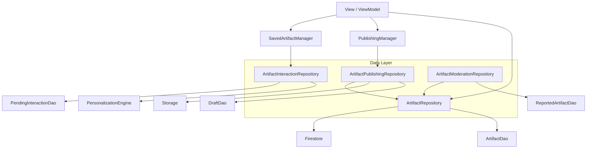

# Repository Ownership Audit: ArtifactRepository

**Confidence Level:** Level 2 – Code Evidence

## Objective
Perform a static architectural analysis of `ArtifactRepository` to identify cohesive business responsibilities and recommend decomposition boundaries based on business ownership rather than file size.

---

## 1. Responsibility Matrix
Grouping of public methods by business capability.

| Capability | Methods | Primary Dependencies |
| :--- | :--- | :--- |
| **Discovery & Retrieval** | `getArtifact`, `getArtifactDetail`, `getArtifactById`, `getArtifactsByIds`, `getUserArtifacts`, `observeArtifact`, `getArtifactsPager` | `firestore`, `artifactDao`, `ArtifactRemoteMediator` |
| **Content Lifecycle** | `uploadArtifactResumable`, `createArtifactDocument`, `finalizeArtifactDocument`, `uploadTranscript`, `renamePublishedArtifact`, `deletePublishedArtifact` | `storage`, `firestore`, `draftDao`, `userRepository` |
| **Interactions (Saved)** | `saveArtifact`, `unsaveArtifact`, `getSavedArtifactIds`, `getSavedArtifacts` | `firestore`, `pendingInteractionDao`, `InteractionSyncWorker` |
| **Engagement & Feedback** | `recordPlay`, `submitPrivateFeedback` | `firestore`, `personalizationEngine`, `settingsRepository` |
| **Moderation & Safety** | `submitReport`, `getPendingReports`, `resolveReport` | `firestore`, `reportedArtifactDao`, `artifactDao` |
| **Maintenance** | `runCacheCleanup`, `updateLocalAuthorSnapshot` | `artifactDao`, `AppDatabase` |
| **AI Insights** | `getSmartReflectionPrompt` | `aiService` |

---

## 2. Shared Dependencies & Extraction Potential

### Shared Core
- **`FirebaseFirestore`**: Ubiquitous. Every capability relies on Firestore.
- **`ArtifactDao`**: Shared between Discovery (Caching), Moderation (Immediate hiding), and Lifecycle (Sync).
- **`DiagnosticLogger`**: Required by all for error tracking.

### Specialized Dependencies
- **`FirebaseStorage`**: Only needed by **Content Lifecycle** (`uploadArtifactResumable`, `uploadTranscript`).
- **`PendingInteractionDao`**: Only used by **Interactions** (`saveArtifact`, `unsaveArtifact`).
- **`ReportedArtifactDao`**: Only used by **Moderation** (`submitReport`).
- **`PersonalizationEngine`**: Only used by **Engagement** (`recordPlay`, `submitPrivateFeedback`).
- **`ReflectionAIService`**: Only used by **AI Insights**.

> [!TIP]
> Capabilities with specialized dependencies are prime candidates for extraction as they reduce the overall constructor footprint of the primary repository.

---

## 3. Proposed Repository Boundaries

Based on business ownership and dependency isolation, the following boundaries are recommended:

### A. `ArtifactRepository` (Core Discovery)
- **Role**: Read-side authority and local cache manager.
- **Methods**: `getArtifact`, `getArtifactById`, `getUserArtifacts`, `observeArtifact`, `getArtifactsPager`, `runCacheCleanup`.
- **Impact**: remains the primary entry point for displaying artifacts in the UI.

### B. `ArtifactPublishingRepository`
- **Role**: Write-side authority for content creation and modification.
- **Methods**: `uploadArtifactResumable`, `createArtifactDocument`, `finalizeArtifactDocument`, `uploadTranscript`, `renamePublishedArtifact`, `deletePublishedArtifact`.
- **Impact**: Isolates `FirebaseStorage` and `DraftDao` dependencies. Directly serves `PublishingManager`.

### C. `ArtifactInteractionRepository`
- **Role**: Manages user-artifact relationships (Bookmarks, Feedback, Play history).
- **Methods**: `saveArtifact`, `unsaveArtifact`, `getSavedArtifacts`, `recordPlay`, `submitPrivateFeedback`.
- **Impact**: Isolates `PendingInteractionDao` and `PersonalizationEngine`. Directly serves `SavedArtifactManager`.

### D. `ArtifactModerationRepository`
- **Role**: Safety, reporting, and administrative controls.
- **Methods**: `submitReport`, `getPendingReports`, `resolveReport`.
- **Impact**: Isolates `ReportedArtifactDao`. Separates user features from administrative/safety features.

---

## 4. Dependency Graph (Target State)

---

## 5. Migration Complexity & Risks

### Complexity: **Medium**
- **Hilt Impact**: Requires updating `@Provides` or `@Inject` sites. Currently, most callers inject `ArtifactRepository`.
- **Callers**: `PublishingManager` and `SavedArtifactManager` are the largest consumers. ViewModels for the Home Feed and Profile heavily use the Discovery methods.

### Risks
- **Circular Dependencies**: `ArtifactPublishingRepository` needs `ArtifactRepository` to check remote state before upload. `ArtifactRepository` must remain at the bottom of the hierarchy.
- **Local Cache Sync**: `deletePublishedArtifact` and `submitReport` both perform immediate local cache eviction via `artifactDao`. This logic must be preserved in the new repositories to avoid "Ghost Artifacts" in the UI.
- **Internal Sync Methods**: Methods like `saveArtifactToFirestore` are marked `internal` for use by `InteractionSyncWorker`. These must be moved to the `InteractionRepository` and still be accessible to the worker.

---

## 6. Recommendations
1. **Prioritize Interaction Extraction**: Moving Saved/Play logic to `ArtifactInteractionRepository` removes the `PendingInteractionDao` and `PersonalizationEngine` from the main repository, which are distinct from core artifact data.
2. **Move AI to AI Service**: `getSmartReflectionPrompt` is a pass-through to `aiService`. This should be called directly by ViewModels or a Domain-level `ReflectionManager`, removing `aiService` from the repository entirely.
3. **Consolidate Moderation**: Reporting logic is currently scattered. Centralizing it in `ArtifactModerationRepository` improves safety auditability.
