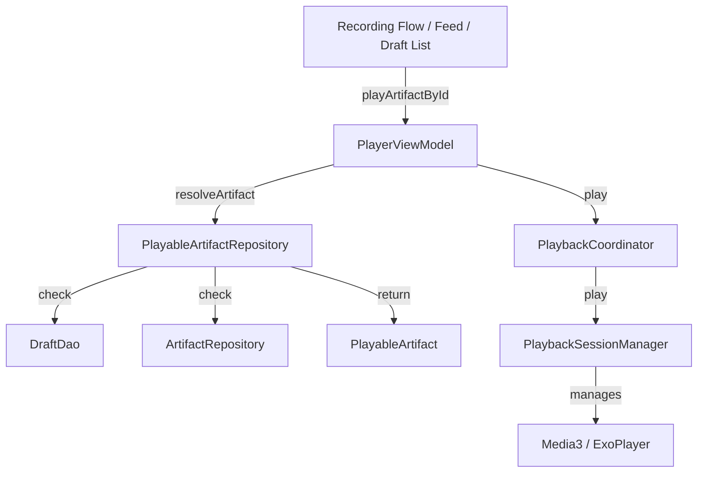

# Fix Artifact Review Flow Consistency (Architectural Refactor)

The goal is to fix the bug where tapping "Review Artifact" after recording navigates to the Home Screen without opening the player. This refactor unifies the resolution of playable artifacts (Drafts and Published) and introduces a robust loading state system.

## Final Architecture Diagram



## Proposed Changes

### 1. Domain Model: Unified Playable Artifact

#### [NEW] [PlayableArtifact.kt](file:///F:/Android%20Project/01/app/src/main/java/com/saurabh/artifact/model/PlayableArtifact.kt)

- Introduce a sealed class or data class to wrap both Drafts and Published artifacts for the player.
- Logic:
```kotlin
data class PlayableArtifact(
    val id: String,
    val title: String,
    val audioUrl: String,
    val authorName: String,
    val authorSigil: String,
    val avatarSeed: String,
    val durationMs: Long,
    val sourceType: PlaybackSource,
    val originalArtifact: Artifact? = null,
    val originalDraft: ArtifactDraftEntity? = null
)

enum class PlaybackSource {
    REVIEW_NEW_RECORDING,
    REVIEW_DRAFT,
    FEED_PLAYBACK,
    PROFILE_PLAYBACK
}
```

---

### 2. Data Layer: Playable Artifact Resolution

#### [NEW] [PlayableArtifactRepository.kt](file:///F:/Android%20Project/01/app/src/main/java/com/saurabh/artifact/repository/PlayableArtifactRepository.kt)

- Implements `resolveArtifact(id: String, source: PlaybackSource): Result<PlayableArtifact>`.
- Logic:
    1. Check `DraftDao` for local draft.
    2. Check `ArtifactRepository` for published artifact (Firestore).
    3. Map to `PlayableArtifact`.

---

### 3. UI Layer: Player State & UI

#### [PlayerUiState.kt](file:///F:/Android%20Project/01/app/src/main/java/com/saurabh/artifact/ui/player/PlayerUiState.kt)

- Add `loadState: PlayerLoadState`.
- Update `currentArtifact` to `currentPlayableArtifact: PlayableArtifact?`.

#### [PlayerViewModel.kt](file:///F:/Android%20Project/01/app/src/main/java/com/saurabh/artifact/ui/player/PlayerViewModel.kt)

- Update `playArtifactById(id: String, source: PlaybackSource)`.
- Implement `PlayerLoadState` transitions.
- Use `PlayableArtifactRepository` for resolution.

#### [ArtifactPlayerView.kt](file:///F:/Android%20Project/01/app/src/main/java/com/saurabh/artifact/ui/player/ArtifactPlayerView.kt)

- Update to handle `LOADING` and `ERROR` states.
- Ensure it doesn't return early when `currentArtifact` is null if `loadState` is `LOADING`.

---

### 4. Navigation & Flow

#### [RecordingNavigation.kt](file:///F:/Android%20Project/01/app/src/main/java/com/saurabh/artifact/navigation/features/RecordingNavigation.kt)

- Update `onReview` calls to pass `PlaybackSource.REVIEW_NEW_RECORDING`.

---

## Verification Plan

### Automated Tests
- `PlayableArtifactRepositoryTest`: Verify resolution order (Local > Remote).
- `PlayerViewModelTest`: Verify state transitions (`IDLE` -> `LOADING` -> `LOADED`).

### Manual Verification
1.  **Post-Recording Review**: Verify player expands immediately and starts loading.
2.  **Draft List Review**: Verify existing drafts load correctly.
3.  **Feed Playback**: Verify normal feed artifacts still work.
4.  **Error Case**: Simulate missing file/network error and verify `ERROR` state UI.
